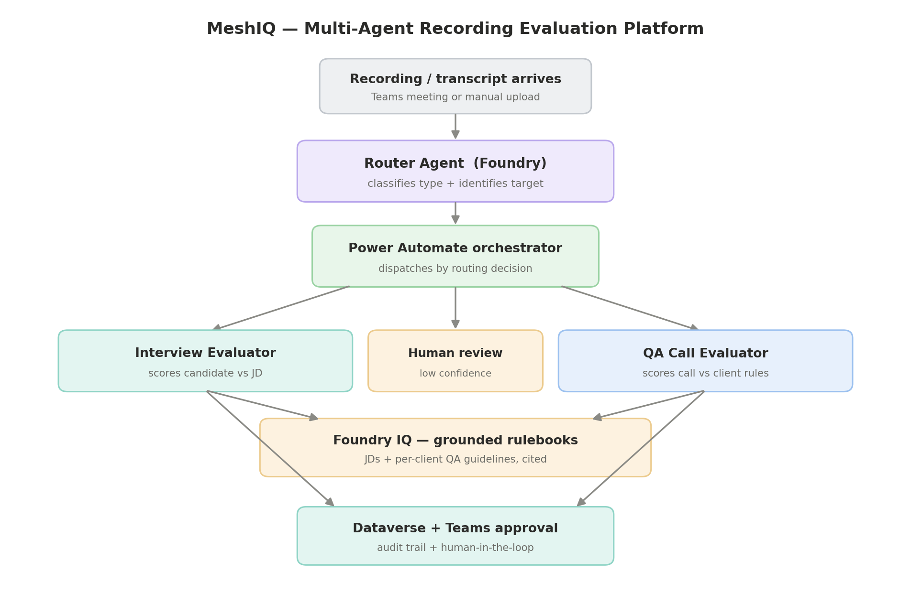

# MeshIQ — Multi-Agent Recording Evaluation Platform

**One line:** MeshIQ automatically ingests any meeting or call recording, figures out what it is, routes it to the right specialist AI evaluator, and scores it against the correct rulebook — interviews against a job description, support/QA calls against the specific client's guidelines — with grounded citations and a human-in-the-loop approval step in Microsoft Teams.

> Submitted to **Agents League Hackathon 2026** — Reasoning Agents, Enterprise Agents, and Creative Apps tracks.

---

## The problem

In any BPO, recruiting team, or contact center, recordings pile up faster than humans can review them. A QA supervisor manually reviews calls for compliance; a recruiter re-watches interviews to score candidates. The work is slow, inconsistent between reviewers, and creates audit risk. Worse, the *rules differ per context* — every client has its own QA standards, every role its own bar — so a single rigid checklist doesn't work.

**MeshIQ removes the manual triage and first-pass evaluation entirely**, while keeping a human in control of the final decision.

---

## What makes it different

Most submissions are a single agent answering questions. MeshIQ is a **multi-agent system with an orchestrator** that *understands the input before acting on it*:

- A **Router Agent** classifies each recording (interview vs QA call) and identifies its target (which role, or which client) — then dispatches to the right specialist. No fixed pipeline; the system decides.
- Two **Specialist Evaluators** each apply a different, dynamically-retrieved rulebook and produce a visible step-by-step reasoning trace with citations.
- A **human-in-the-loop approval** in Teams gates every action — nothing is finalized without a person clicking Approve/Reject.
- **Confidence-based escalation** — when the router or an evaluator is unsure, it refuses to guess and routes to human review instead.

---

## Architecture



**Flow:** recording/transcript arrives → **Router Agent** (Microsoft Foundry) classifies + identifies target → **Power Automate** orchestrates the dispatch → correct **Specialist Evaluator** (Foundry) scores against the rulebook retrieved from **Foundry IQ** → results written to **Dataverse** → **adaptive card** posted to **Teams** for human approval → decision written back to Dataverse.

| Layer | Technology |
|---|---|
| Agents (router + 2 evaluators) | Microsoft Foundry |
| Grounded rulebook retrieval | **Foundry IQ** (Azure AI Search index over JDs + client guidelines) |
| Orchestration | Power Automate (AI Foundry connector + Dataverse connector) |
| Data + audit trail | Dataverse |
| Human-in-the-loop | Teams adaptive cards (via Power Automate) |
| Conversational Q&A | Copilot Studio agent |
| Dashboard | React, built with GitHub Copilot |

---

## IQ integration (Foundry IQ)

Every compliance and competency finding is **grounded and cited**. The rulebooks (client QA guidelines and job descriptions) are indexed into a single Foundry IQ knowledge layer with metadata tags. At evaluation time, the specialist evaluator retrieves **only the relevant rulebook** for the target the router identified — Globex's regulated collections rules for a Globex call, the Senior Python Developer rubric for that interview — and cites the specific rule behind each finding.

This is a deliberately *deeper* use of Foundry IQ than generic "cited answers": the grounding is **dynamic and per-target**, and it scales to any number of clients or roles just by adding a tagged document — no re-architecting.

## Second IQ layer (Fabric IQ)

MeshIQ uses **two complementary IQ layers**. Foundry IQ grounds each evaluation in
the correct rulebook (above). **Fabric IQ** reasons over the evaluation *entities*:
the four Dataverse tables are linked into Microsoft Fabric via **zero-copy
Dataverse-to-Fabric** integration (no ETL, stays in sync), and an analytics report
over that mirrored data surfaces cross-cutting patterns a document index cannot —
per-client violation trends and candidate scores by role.

This is the contrast that makes it a genuine two-IQ story: Foundry IQ answers
"what is the rule?" (document grounding, per evaluation); Fabric IQ answers "what
is the pattern?" (entity analytics, across all evaluations). Per Microsoft's own
guidance, Fabric IQ is the shared context layer for Foundry-built agents.

*Current depth: Dataverse→Fabric link live + analytics report. A full Fabric IQ
ontology/knowledge graph over the entities is the documented next step (see
`fabric-iq/`).*

---

## Responsible AI & reliability

- **Human-in-the-loop:** every evaluation that fails, scores low, or is low-confidence triggers a Teams approval card; the human decision is recorded.
- **Confidence thresholds:** router and evaluators output a confidence score; below threshold → `human_review`, never a silent guess.
- **Grounded, cited findings:** no compliance verdict without a citation to the source rule — reduces hallucination and makes every decision auditable.
- **Model pinning:** the underlying model deployment is version-pinned to avoid silent behavior drift between runs.
- **Full audit trail:** every recording and evaluation, including the reasoning trace and the human decision, is persisted in Dataverse.

---

## Demo

▶️ **Video:** [PASTE YOUR DEMO VIDEO LINK]

The demo runs a regulated collections call with stacked violations (missing debt-collection disclosure, disclosure of account details to a third party, and threats) through the live pipeline. Watch the router identify the client, the evaluator catch all three regulated breaches with citations, and the approval card land in Teams for a one-click decision.

---

## Evaluation

Tested on a labeled set of 6 synthetic transcripts (2 interviews against one JD; 4 QA calls across 2 clients, including a regulated multi-violation hard case). The harness runs the **production pipeline**, not a separate rig.

| Metric | Result |
|---|---|
| Routing (type) accuracy | **100%** (6/6) |
| Target identification accuracy | **100%** (6/6) |
| Outcome accuracy (pass/fail, hire/no-hire) | **100%** (6/6) |

Per-transcript: strong Python candidate and weak candidate correctly separated;
both compliant calls scored 100; the Acme violation scored 45 (missing greeting +
skipped identity verification); the Globex regulated-violation hard case scored 1
(missing debt-collection disclosure, third-party disclosure, and threats all
caught). The harness runs the production Power Automate pipeline, not a separate rig.

Scoring script and answer key in [`/eval-harness`](eval-harness/).

---

## Engineering notes (real constraints, real decisions)

Built across a multi-tenant setup (Foundry in one tenant, Dataverse in another). Two constraints shaped the architecture, and routing around them cleanly is part of the story:

1. **Foundry agents were Entra-only (API keys disabled)** in the sandbox, so a direct Azure Function call was rejected (401). **Resolution:** moved orchestration to Power Automate, whose AI Foundry connector authenticates with the trusted identity — which also collapsed the cross-tenant Dataverse hop since Power Automate and Dataverse share a tenant.
2. **Copilot Studio publishing required a license** not available. **Resolution:** delivered the Teams human-in-the-loop via Power Automate adaptive cards (no license needed); the conversational agent runs in Copilot Studio. The approval capability — the part that matters — is fully functional either way.

---

## Known limitations (environment-imposed, by design elsewhere)

Transparency on what is demonstrated vs. what is production-design:

- **Ingestion trigger:** In this demo, transcripts are dropped into Blob Storage
  to start the pipeline. In production, the Microsoft Graph Teams "transcript
  available" subscription feeds the same pipeline (payloads + flow design in
  `/ingestion`). The demo tenant has **transcription restricted by policy** and
  **no Teams admin PowerShell** to grant the application access policy, so live
  auto-pickup is documented rather than run. Everything downstream of the trigger
  is identical and fully automated.
- **Teams agent publishing:** The conversational Copilot Studio agent runs in the
  test pane; publishing to a Teams channel requires a Copilot Studio user license
  not available in the sandbox. The human-in-the-loop **approval experience is
  delivered via Power Automate adaptive cards**, which needs no such license and
  is fully functional.
- **Foundry agent auth:** The sandbox has key-based auth disabled (Entra-only),
  so orchestration runs through Power Automate's AI Foundry connector (trusted
  identity) rather than a direct Azure Function call.

None of these limit the core capability — they shaped the architecture, and the
chosen paths are honest, working alternatives.

## Repository structure

```
meshiq/
├── README.md
├── architecture/           architecture diagrams
├── router-agent/           router system prompt
├── interview-evaluator/    interview evaluator system prompt
├── qa-evaluator/           QA evaluator system prompt
├── flow/                   Power Automate orchestration (parse schemas, notes)
├── control-room/           Teams adaptive card + approval handling
├── ingestion/              live Teams ingestion design + Graph subscriptions
├── fabric-iq/              second IQ: Dataverse→Fabric link + analytics report
├── eval-harness/           scoring script + answer key + results + test data
├── dashboard/              dashboard (GitHub Copilot)
└── docs/                   rulebooks (JDs + client guidelines)
```

## Roadmap

- **Fabric IQ ontology/knowledge graph** over the linked evaluation entities for
  natural-language cross-client reasoning (current: link + analytics report live).
- **Live Teams auto-ingestion** via Graph change notifications (currently: drop-transcript trigger).
- Bulk historical re-evaluation and per-agent coaching reports.

---

*Built for Agents League Hackathon 2026.*
